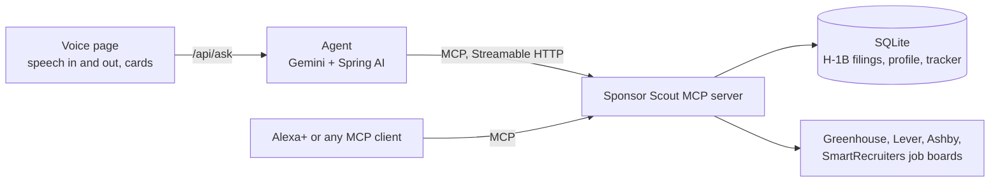

# Sponsor Scout

A voice-first job search assistant for people on F-1 OPT or H-1B, served as an MCP server
(Streamable HTTP, MCP spec 2025-11-25).

It answers the questions international job seekers ask every day:

- "Who sponsors H-1B for data analysts in Texas?"
- "Does Stripe sponsor, and for which roles?"
- "What's new today that fits me, at companies that actually file H-1B paperwork?"
- "I applied to the ServiceNow one. Remind me to follow up."

## How it works

- **Sponsor history** comes from the US Department of Labor's LCA disclosure data (certified H-1B cases), with a
  full-text index on job titles so most lookups take well under half a second.
- **Openings** come live from the public Greenhouse, Lever, Ashby and SmartRecruiters job boards of 109
  companies, cached and refreshed every 30 minutes so a voice request never waits on 100+ boards.
- **Filtering:** postings that refuse sponsorship ("unable to sponsor", "US citizens only") or ask for far more
  experience than you have are dropped. Openings at employers with H-1B filings for similar titles rank first.
- **Memory:** your profile and application tracker live in SQLite, so the assistant picks up where you left
  off in the next conversation.
- **Voice first:** every tool returns a short `speech` line meant to be read aloud, plus structured data for a
  screen.

## Voice page

`http://localhost:8080` is a simulated Alexa+ session. You talk, the browser turns speech into text, an agent
(Gemini through Spring AI) decides which tools to call and chains them, and the answer is spoken back while the
results show up as cards. The agent reaches the tools over MCP at this app's own `/mcp` endpoint, exactly the way
Alexa+ or any other MCP client would, so the demo exercises the real server.



The screen state goes along with each request, so "save the second one" works. Your profile and tracker are
in SQLite, so the next conversation picks up where the last one ended.

## Tools

| Tool | What it does |
|---|---|
| `set_profile` / `get_profile` | Target roles, skills, years of experience, states, visa status |
| `find_sponsors` | Employers with the most certified H-1B filings for a title, optionally in one state |
| `check_sponsor` | One employer's record: filings, new hires vs transfers, common titles, wages, cities |
| `find_openings` | Live US openings matched to the profile, with the employer's H-1B record attached |
| `save_job` / `update_status` | Track jobs; marking one applied sets a follow-up reminder |
| `list_applications` | The tracker, optionally by status |
| `daily_briefing` | New openings since you last looked, follow-ups due, pipeline counts |
| `prep_application` | Posting text, the employer's record for similar titles, which of your skills it mentions |

## Run it

Needs Java 17 or newer.

1. Download an LCA disclosure file (xlsx) from the
   [DOL performance data page](https://www.dol.gov/agencies/eta/foreign-labor/performance).
   The site blocks scripted downloads, so use a browser.
2. Build and load the data:

   ```bash
   ./mvnw -q package
   java -jar target/sponsor-scout-0.1.0.jar ingest ~/Downloads/LCA_Disclosure_Data_FY2025_Q4.xlsx
   ```

   You can pass several quarterly files at once. One quarter takes about a minute.
3. Start the server:

   ```bash
   java -jar target/sponsor-scout-0.1.0.jar
   ```

   The MCP endpoint is `http://localhost:8080/mcp`. The database defaults to `data/scout.db`; set `SCOUT_DB`
   to move it.
4. For the voice page, get a free Gemini API key at [Google AI Studio](https://aistudio.google.com/api-keys)
   and put it in a `.env` file in the folder you start the server from (it's gitignored):

   ```
   GEMINI_API_KEY=your-key
   ```

   Restart and open `http://localhost:8080` in Chrome, Edge or Safari (voice input needs one of those). The
   model defaults to `gemini-3.5-flash-lite`, which has the most generous free tier that handles tool calling
   well (500 requests a day). Set `SCOUT_MODEL` to change it. Without a key the MCP server still works and the
   page says the assistant is offline.

Try it with the MCP Inspector:

```bash
npx @modelcontextprotocol/inspector --cli http://localhost:8080/mcp --transport http --method tools/call --tool-name check_sponsor --tool-arg company=Stripe
```

## About the data

An LCA (Labor Condition Application) is the wage filing an employer has to get certified before it can file an
H-1B petition. A certified LCA shows the employer intends to hire someone on H-1B for that role at that wage.
It is not a petition approval, and one LCA can cover more than one worker. The ingest keeps certified H-1B cases
only and skips contact names and emails.

## Friction log

Problems I hit with the Alexa+ and MCP tooling while building this, with suggestions, are in
[FRICTION.md](FRICTION.md).

## Stack

Java 17, Spring Boot 4.1, Spring AI 2.0 (MCP server, MCP client, ChatClient with Gemini), MCP Java SDK 2.0, SQLite.
The voice page is plain HTML and JavaScript using the browser Web Speech API.

## License

MIT
